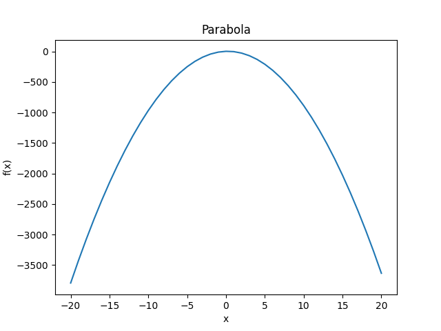

# Computor v1
## Table of Contents
* [Introduction](#introduction)
* [Python Requirements](#python-Requirements)
* [Usage](#usage)
* [Exemple](#exemple)
  * [Normal](#normal)
  * [Verbose On](#verbose-on)
  * [Graph On](#graph-on)
* [More info](#more-info)
  
## Introduction
This project aims to make you code a simple equation solving program. It will take
polynomial equations into account. These equations will only require exponents.
No complex function. The program will have to display its solution(s).  
  
Why polynomials? Just because it’s one of the simplest and most powerful tools in
mathematics. It is used in every field on every level to simplify and express many things.
For instance, they help calculate functions such as sin, cos, et tan.  
  
## Python Requirements
**install requirements:** <code>$ python3 -m pip install -r requirements.txt</code>  
  
## Usage
<pre><code>usage: computor.py [-h] [-v] [-g] poly

positional arguments:
  poly           polynom to process

optional arguments:
  -h, --help     show this help message and exit
  -v, --verbose  show detail operations performed
  -g, --graph    show polynomial graph</code></pre>  
  
## Exemple
### Normal
<pre><code>$ ./computor.py "5 * X^0 + 4 * X^1 - 9.3 * X^2 = 1 * X^0"
Reduced form: -9.3 * X^2 + 4 * X + 4 = 0
Polynomial degree: 2
Discriminant is strictly positive, the two solutions are:
0.905239
-0.475131</pre></code>
  
### Verbose On
<pre><code>$ ./computor.py -v "5 * X^0 + 4 * X^1 - 9.3 * X^2 = 1 * X^0"
Reduced form: -9.3 * X^2 + 4 * X + 4 = 0
form: a*x^2 + b*x + c = 0
a: -9.3
b: 4
c: 4

Δ: b^2 - 4*a*c = 164.8

x1: (-b - √Δ) / (2*a)
x2: (-b + √Δ) / (2*a)

Polynomial degree: 2
Discriminant is strictly positive, the two solutions are:
0.905239
-0.475131</pre></code>
  
### Graph On
<pre><code>$ ./computor.py -g "5 * X^0 + 4 * X^1 - 9.3 * X^2 = 1 * X^0"
Reduced form: -9.3 * X^2 + 4 * X + 4 = 0
Polynomial degree: 2
Discriminant is strictly positive, the two solutions are:
0.905239
-0.475131</pre></code>
**Open image:** <code>$ xdg-open mygraph.png</code>  

  
## More info
**Autor:** [Antoine Mauffret](https://github.com/AntoineMau)  
  
**Subject:** [Computor v1](https://cdn.intra.42.fr/pdf/pdf/13223/en.subject.pdf)
